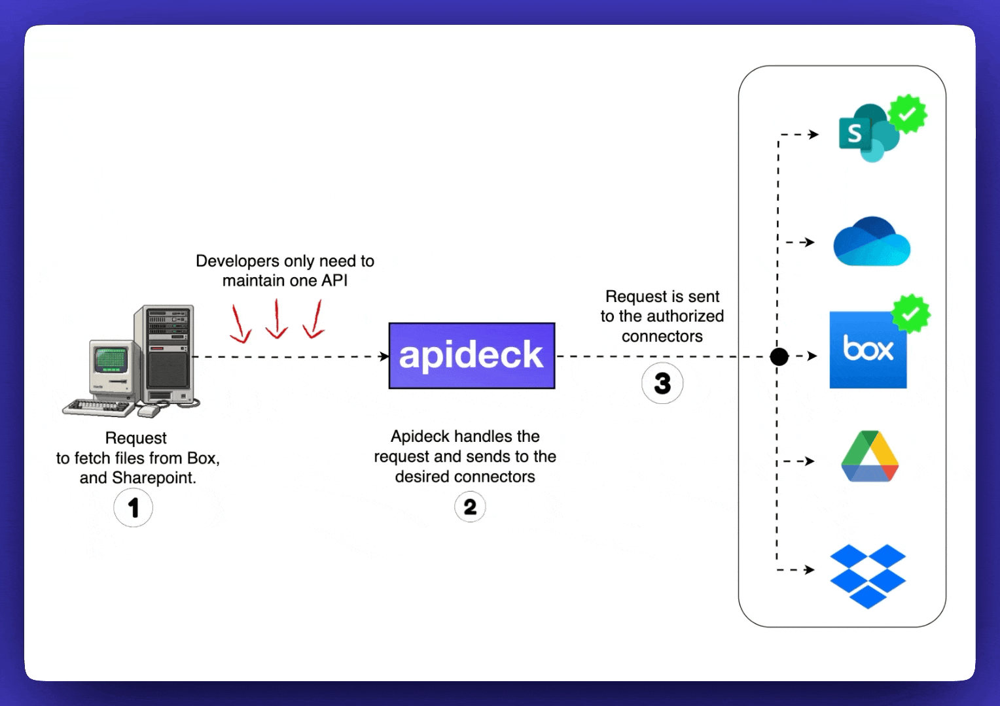
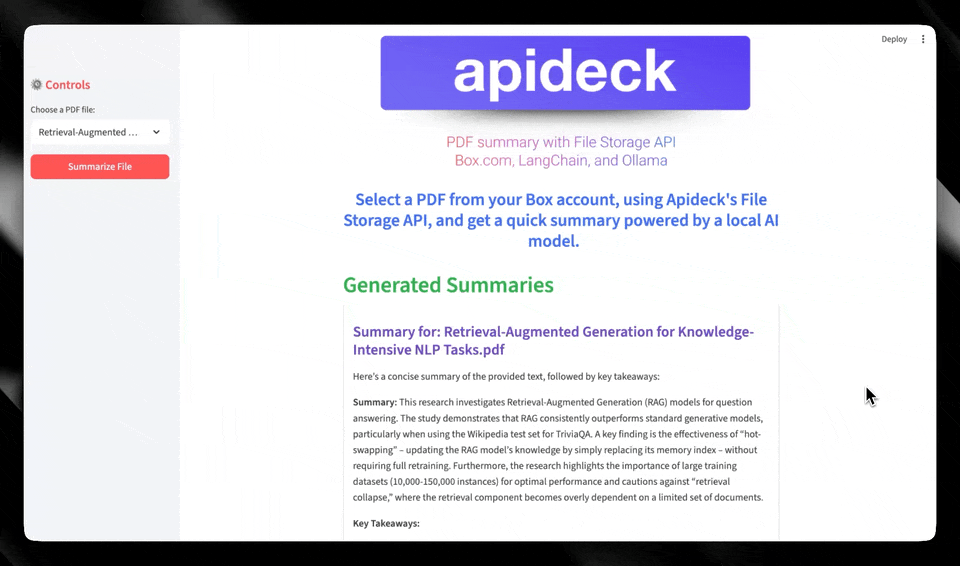

# API Powered RAG using Apideck, LangChain, Ollama, and Gemma 3


An example of API powered RAG using Apideck's File Storage API.



This project is a simple web application built with Streamlit that demonstrates an API-based Retrieval-Augmented Generation (RAG) workflow. The application connects to a user's Box.com account using the Apideck File Storage API, fetches a list of PDF files, and allows the user to select one for summarization. The summary is generated by a local Large Language Model running via Ollama and orchestrated by LangChain.



### Core Technologies

- Backend & API: Apideck File Storage API (Box Connector)
- AI Orchestration: LangChain
- Language Model: Ollama (with Google's Gemma model)
- Web Framework: Streamlit
- Environment Management: uv

### Setup and Installation

1. Prerequisites

- Python 3.11+
- Ollama installed and running.
- The desired model pulled via Ollama (e.g., ollama run gemma3:1b-it-qat).
- An Apideck account with the File Storage API enabled and a Box connection configured.

2. Set Up the Environment
First, clone the repository. Then, set up and activate the Python virtual environment using uv.

```bash
# Create the virtual environment
uv venv

# Activate the environment (macOS/Linux)
source .venv/bin/activate
```

3. Install Dependencies
Install all the required Python packages from the requirements.txt file.

```bash
uv pip install -r requirements.txt
```

4. Configure Credentials
Create a .env file in the root of the project directory and add your Apideck credentials.

```bash
APIDECK_API_KEY="sk_live_..."
APIDECK_APP_ID="YOUR_APP_ID..."
APIDECK_CONSUMER_ID="test-consumer"
```

You can get your API_KEY and APP_ID from your Apideck dashboard.

### How to Run

With your Ollama server running and the environment set up, start the Streamlit application with the following command:

```bash
streamlit run app.py
```

The application will open in your web browser.
